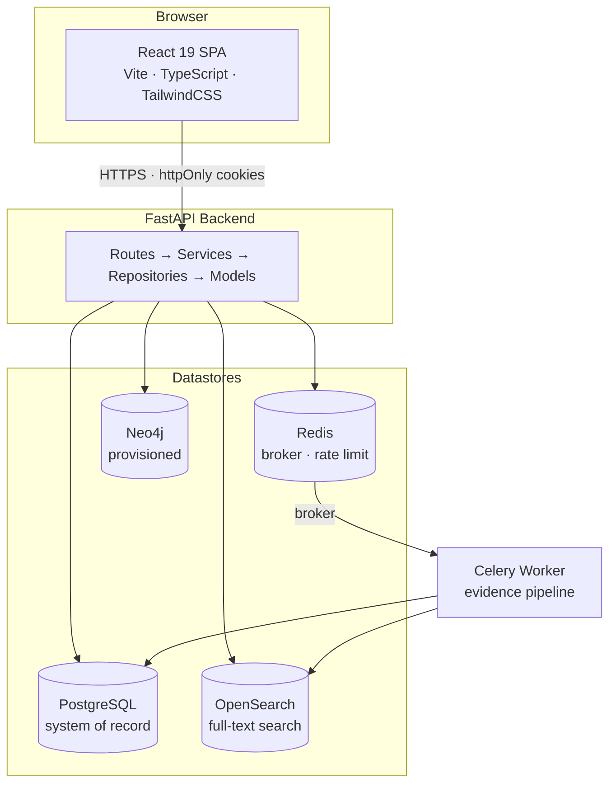
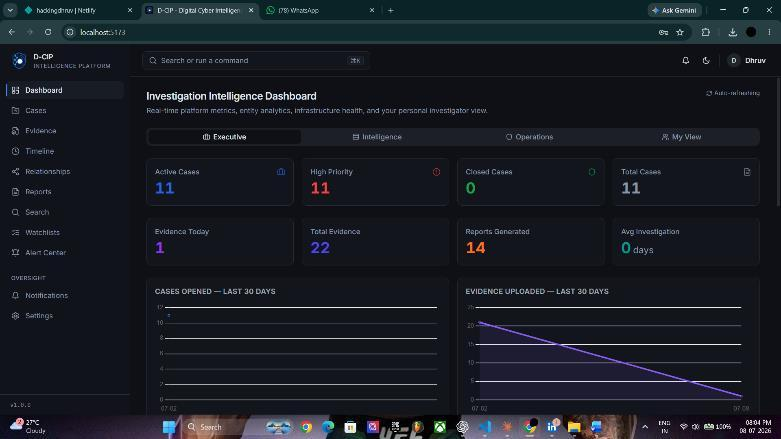
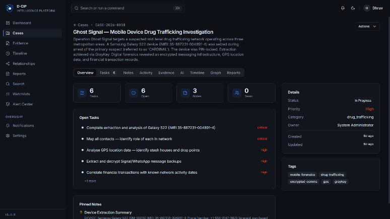
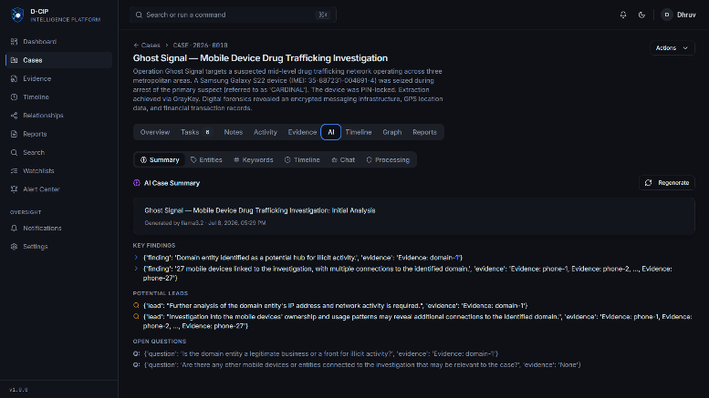
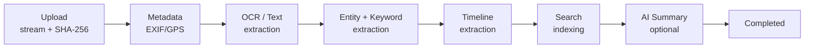

<div align="center">
  

  <h1>D-CIP</h1>
  <h3>Digital Cyber Intelligence Platform</h3>

  <p><em>Transforming Digital Evidence into Actionable Intelligence</em></p>

  <p>
    
    
    
    
    
    
    
  </p>
</div>

> The logo above is a placeholder mark redrawn in-repo from the approved brand sheet. Swap `apps/web/src/assets/dcip-mark.svg` and `apps/web/public/favicon.svg` for the final exported artwork when available.

---

## Overview

D-CIP is an AI-augmented investigation management platform for cybercrime units and digital forensics teams. It replaces the shared-folder-and-spreadsheet workflow most units run on today with a single workspace: upload evidence, and the platform hashes it, extracts entities and timeline events, indexes it for search, builds an evidence-relationship graph, and — when an AI provider is configured — summarizes it and answers questions strictly scoped to that case's evidence.

Every AI claim is evidence-cited. Every evidence action is logged to an immutable chain-of-custody trail. Every route is permission-checked server-side. The platform runs fully with AI disabled — nothing else degrades.

---

## Key Features

<table>
<tr>
<td width="50%" valign="top">

**🗂️ Investigation Management**
Case workspace with status workflow, tasks, pinned notes, and multi-user team assignment with per-case roles.

**🔍 Evidence Intelligence**
Streamed upload with incremental SHA-256 hashing, an async processing pipeline (metadata → OCR → entity/keyword extraction → timeline → search indexing), and an append-only chain-of-custody log. Deletion is always soft — originals are never removed.

**🧠 AI Assistant** *(optional)*
Evidence-scoped chat that only answers from the current case's processed evidence, cites the specific evidence item for every claim, and explicitly says so when evidence is insufficient. Runs against OpenAI, any OpenAI-compatible endpoint, or a local Ollama model — or stays fully off.

</td>
<td width="50%" valign="top">

**🕸️ Entity Relationship Graph**
Interactive React Flow graph built from entity co-occurrence across a case's evidence — emails, IPs, hashes, wallets, people, and organizations linked by shared appearances.

**📄 Reporting Engine**
9 report types across 6 templates, exported as PDF, DOCX, HTML, or JSON, with version history and AI-generated sections explicitly flagged.

**🔔 Watchlists & Alerts**
16 IOC types (email, domain, IP, crypto wallet, file hash, IMEI, and more) matched automatically against every new evidence item, with severity-ranked alerts and per-user notifications.

**🔐 Role-Based Access Control**
Five roles, granular `resource:action` permissions, enforced via a FastAPI dependency on every protected route — not just hidden in the UI.

</td>
</tr>
</table>

<details>
<summary><strong>Full feature list</strong></summary>

| Area | Capabilities |
|---|---|
| **Cases** | Status workflow, task tracking, pinned notes, activity feed, team assignment, import-from-document |
| **Evidence** | Multi-format upload (PDF, Office docs, email, images, archives), SHA-256 integrity with on-demand re-verification, chain of custody, soft delete only |
| **Entity extraction** | Regex-based IOCs (emails, IPv4/IPv6, phones, domains, URLs, MD5/SHA1/SHA256, BTC/ETH wallets, IBANs, Indian vehicle plates) plus spaCy NLP for people, organizations, and locations |
| **Timeline** | Automatic event extraction from evidence, manual event authoring, gap/conflict/duplicate detection, merge and verification workflow |
| **Search** | Ctrl+K universal search across cases, evidence, entities, notes, tasks, and timeline events; OpenSearch-backed full-text search over evidence content when enabled |
| **AI** | Case summaries, evidence summaries, evidence-scoped chat with mandatory citations, deterministic-plus-narrative timeline analysis |
| **Reporting** | Executive, Detailed, Evidence Inventory, Timeline, Chain of Custody, Entity Intelligence, AI Findings, Case Progress, and Activity reports |
| **Watchlists & Alerts** | Exact/regex/cross-case matching, repeated-appearance heuristics, per-user notification feed |
| **Dashboards** | Executive, Intelligence, Operations, and Investigator views |
| **Administration** | User/role/permission management, session revocation, audit log search, system health, AI config, storage stats |

</details>

---

## Architecture Overview



The frontend talks to the API exclusively over `/api/v1`, authenticated with httpOnly JWT cookies. The API never blocks on background work — evidence processing is dispatched to Celery and the pipeline runs independently, updating the evidence record's status as it progresses. Neo4j is provisioned in the stack and health-checked, but the current entity-relationship graph is computed directly from PostgreSQL entity co-occurrence rather than a graph-database query — see [`ARCHITECTURE.md`](ARCHITECTURE.md) for the full breakdown.

---

## Technology Stack

| Layer | Technology |
|---|---|
| Frontend | React 19, Vite 5, TypeScript, TailwindCSS, shadcn/ui |
| Data fetching | TanStack React Query v5, React Router v6 |
| Visualization | Chart.js, React Flow |
| Backend | FastAPI 0.115+, Python 3.13 |
| ORM / migrations | SQLAlchemy 2.x (sync), Alembic |
| Schema validation | Pydantic v2 |
| Task queue | Celery 5.4 + Redis 7 |
| Database | PostgreSQL 16 |
| Graph database | Neo4j 5 Community *(provisioned; not yet load-bearing)* |
| Full-text search | OpenSearch 2.17 *(optional, flag-gated)* |
| OCR | Tesseract + pytesseract |
| NLP | spaCy (`en_core_web_sm`) |
| AI | Any OpenAI-compatible provider, or local Ollama |
| Containerization | Docker, Docker Compose, NGINX |

---

## Screenshots

| Executive Dashboard | Case Workspace |
|---|---|
|  |  |

| AI Case Summary |
|---|
|  |

<details>
<summary><strong>Remaining captures (Evidence & Timeline, Entity Graph, Reports) — pending</strong></summary>

| Evidence & Timeline | Entity Graph | Reports |
|---|---|---|
| `docs/screenshots/timeline.png` | `docs/screenshots/graph.png` | `docs/screenshots/reports.png` |

</details>

---

## Quick Start

### Prerequisites

- [Docker](https://docker.com) and Docker Compose
- Node.js 20.11+ and [pnpm](https://pnpm.io) 9+ (only if running the frontend outside Docker)
- Python 3.13 and [uv](https://docs.astral.sh/uv/) (only if running the backend outside Docker)

### Clone

```bash
git clone https://github.com/Hackingdhruv/D-CIP.git
cd D-CIP
```

### Environment Variables

```bash
cp .env.example .env
```

At minimum, set a real `SECRET_KEY` before any non-local use:

```bash
python -c "import secrets; print(secrets.token_urlsafe(64))"
```

The API refuses to start in production (`DCIP_ENV=production`) with the placeholder `SECRET_KEY` or `AUTH_COOKIE_SECURE=false`. See [`.env.example`](.env.example) for every available setting — datastore connections, AI provider, OCR, and OpenSearch are all configured there.

### Docker Setup

```bash
docker compose -f infrastructure/docker/docker-compose.yml --profile dev up --build
```

This starts PostgreSQL, Redis, Neo4j, OpenSearch, the API, the Celery worker, and the web app. Add the `prod` profile instead to include the NGINX edge proxy.

### Run the Application

```bash
# Apply database migrations (also seeds RBAC roles/permissions + the default admin)
docker compose exec api uv run alembic upgrade head
```

| Service | URL |
|---|---|
| Frontend | http://localhost:5173 |
| API | http://localhost:8000 |
| API Docs (non-production only) | http://localhost:8000/docs |

<details>
<summary><strong>Run without Docker</strong></summary>

**Backend:**
```bash
cd apps/api
uv sync
uv run alembic upgrade head
uv run uvicorn app.main:app --reload --host 0.0.0.0 --port 8000
```

**Worker** (separate terminal):
```bash
cd apps/api
uv run celery -A app.worker.celery_app worker --loglevel=info
```

**Frontend** (separate terminal):
```bash
cd apps/web
pnpm install
pnpm dev
```

</details>

### Default Demo Credentials

The first migration seeds one Administrator account for local development:

| | |
|---|---|
| **Email** | `admin@dcip.local` |
| **Password** | `Admin@dcip.2024!` |

> ⚠️ Rotate or delete this account before any shared or production deployment.

---

## Project Structure

<details>
<summary><strong>Expand full tree</strong></summary>

```
dcip/
├── apps/
│   ├── api/                       FastAPI backend
│   │   ├── app/
│   │   │   ├── api/v1/routes/     18 route modules
│   │   │   ├── core/              Config, auth, security, middleware, DI
│   │   │   ├── db/                SQLAlchemy + Neo4j/Redis/OpenSearch clients
│   │   │   ├── models/            SQLAlchemy models
│   │   │   ├── repositories/      Data access layer
│   │   │   ├── schemas/           Pydantic v2 schemas
│   │   │   ├── services/          Business logic
│   │   │   ├── storage/           File storage backend (local, S3-ready)
│   │   │   └── worker/            Celery app + evidence/watchlist tasks
│   │   ├── alembic/versions/      9 migrations
│   │   └── tests/                 unit/ + integration/
│   │
│   ├── web/                       React 19 + Vite SPA
│   │   └── src/
│   │       ├── components/        Reusable UI (admin, auth, dashboard, reports, ui, ...)
│   │       ├── contexts/          Auth context, permission hooks
│   │       ├── hooks/             React Query hooks, one file per domain
│   │       ├── lib/api/           Typed API client modules
│   │       ├── pages/             Route-level page components
│   │       └── types/             TypeScript interfaces
│   │
│   └── worker/                    Celery worker container definition
│
├── packages/                      Shared TS packages (types, RBAC matrix, UI tokens, config)
├── infrastructure/
│   ├── docker/                    docker-compose.yml (dev + prod profiles)
│   └── nginx/                     Edge proxy + SPA server configs
├── database/                      Postgres extensions, Neo4j/OpenSearch connection config
├── docs/                          Architecture, installation, and development guides
├── ARCHITECTURE.md                Full technical reference
└── README.md
```

</details>

---

## Evidence Processing Pipeline (incl. AI)

Every uploaded file moves through an asynchronous, failure-isolated Celery pipeline — this runs for all evidence, whether or not AI is configured. A failure in any single stage is logged and skipped — it never blocks the rest of the pipeline.



- **Text & OCR** — native text extraction per format (PDF, DOCX, XLSX, EML), with Tesseract OCR fallback for images and text-less PDFs.
- **Entity extraction** — deterministic regex for structured IOCs, plus spaCy NLP for people, organizations, and locations when the model is installed.
- **Timeline extraction** — regex-based date/event detection, mirrored idempotently into the case's canonical timeline.
- **AI summary & chat** — entirely optional. With `AI_PROVIDER=none` (the default), every AI function short-circuits cleanly — the pipeline still reaches `COMPLETED`, and chat returns a plain "AI is not configured" message instead of erroring. When enabled, every response is grounded by a system prompt requiring per-claim evidence citation and an explicit "I don't have enough evidence" fallback.
- **Watchlist matching** — runs as an independent task immediately after entity extraction, checking new entities against every active watchlist and fanning out alerts to case members.

---

## Security Features

| Control | Implementation |
|---|---|
| Authentication | httpOnly cookies, short-lived JWT access tokens (15 min, always), rotating refresh tokens |
| Authorization | `RequirePermission()` FastAPI dependency declared on every protected route |
| Evidence integrity | SHA-256 computed during streaming upload, re-verifiable on demand, immutable custody log |
| Rate limiting | Redis-backed `slowapi` limits (10/min login, 5/min password reset, 120/min default) |
| Security headers | CSP, `X-Frame-Options: DENY`, `X-Content-Type-Options: nosniff`, `Referrer-Policy` |
| Production guards | Startup fails on a placeholder `SECRET_KEY` or `AUTH_COOKIE_SECURE=false` when `DCIP_ENV=production` |
| API docs | Disabled outside non-production environments |
| Audit trail | Auth events, case activity, and evidence custody all logged with actor, timestamp, and context |

To report a security vulnerability, contact: **adlakhadhruv20@gmail.com**

---

## Testing

```bash
cd apps/api
uv run pytest                                    # full suite
uv run pytest --cov=app --cov-report=term-missing
uv run pytest tests/unit/                        # unit only
uv run pytest tests/integration/                 # integration only
```

**428 backend tests**, all passing — service-layer unit tests against a mocked session, plus route-layer integration tests through `TestClient`.

```bash
cd apps/web
pnpm test          # Vitest unit tests
pnpm test:e2e       # Playwright end-to-end
npx tsc --noEmit    # type check
```

---

## Roadmap

<details>
<summary><strong>Phase 2</strong></summary>

- Multi-factor authentication (TOTP)
- SSO / SAML 2.0 / Active Directory
- S3-compatible evidence storage (MinIO / AWS S3 / Azure Blob)
- Automated migration runner on API startup

</details>

<details>
<summary><strong>Phase 3</strong></summary>

- IOC enrichment (VirusTotal, Shodan, WHOIS)
- SIEM integration (Splunk, Microsoft Sentinel, IBM QRadar webhooks)
- Mobile companion app for field reporting
- In-browser PDF / image preview
- Native Neo4j-backed relationship graph

</details>

---

## Documentation

- **[`ARCHITECTURE.md`](ARCHITECTURE.md)** — complete technical reference: layering, data model, the real evidence-pipeline stage order, the AI subsystem's actual grounding mechanism, and a list of every place the docs and the code have diverged.
- **[`docs/installation.md`](docs/installation.md)** — detailed setup instructions.
- **[`docs/development.md`](docs/development.md)** — developer workflow, conventions, and tooling.

---

## License

Copyright © 2026 Dhruv Adlakha. All rights reserved.

This software is proprietary. Unauthorized copying, distribution, or use is prohibited. See [`LICENSE`](LICENSE) for the full terms.

---

## Author

**Dhruv Adlakha**

<div align="center">

*D-CIP — Transforming Digital Evidence into Actionable Intelligence*

</div>
